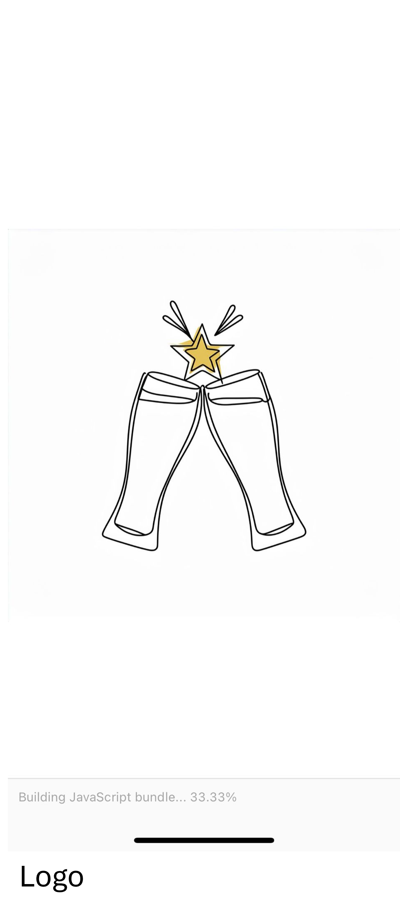

# Bar Voyage App

Bar Voyage is a mobile application built with React Native, designed to help users explore, save, and share their favorite bars. This project utilizes Expo for app management, Firebase for backend services, and various React Native community libraries to provide a seamless user experience.

## Table of Contents

- [Features](#features)
- [Technologies Used](#technologies-used)
- [Getting Started](#getting-started)
- [Screenshots](#screen-shots)
- [License](#license)

## Features

- **User Authentication**: Secure login and registration through Firebase.
- **Explore Bars**: View bars on a map and search by location.
- **Favorites**: Save favorite bars for quick access.
- **Reviews**: Add and view reviews for each bar.
- **Real-Time Updates**: Stay updated with real-time data from Firebase.

## Technologies Used

- **React Native**: Core framework for building the app.
- **Expo**: Manages app builds and testing across platforms.
- **Firebase**: Backend services for authentication and data storage.
- **React Navigation**: Enables in-app navigation.
- **Jest**: Testing framework for unit tests.
- **TypeScript**: Type safety across components.
-

## Getting Started

To set up the project locally, follow these steps.

### Prerequisites

- [Node.js](https://nodejs.org/en/download/)
- [Expo CLI](https://docs.expo.dev/get-started/installation/)
- [Firebase Account](https://firebase.google.com/)

### Installation

1. **Clone the repository**
   ```bash
   git clone https://github.com/your-username/bar-voyage.git
   ```
2. **Navigate to the project directory**
   ```bash
   cd bar-voyage
   ```
3. **Install dependencies**
   ```bash
   npm install
   ```
4. **Set up Firebase**
   - Add your Firebase configuration in `firebaseConfig.js`.
5. **Start the app**
   ```bash
   npm start
   ```

## Screenshots

Below you will see a not extensive collection of screenshots to give a feel of the app.

<p align="center">
  
  
  
</p>

<p align="center">
  
  
  
</p>

<p align="center">
  
  
  
</p>

## License

Distributed under the MIT License.
